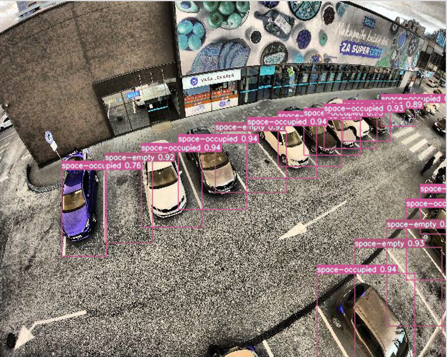

# detection de place de parking utilisant yolov7

## Installation

### installer yolov7 dans le repertoire yolov7 dans ce repertoire

[YOLOv7 github](https://github.com/WongKinYiu/yolov7)

## apt install required package

``` shell
sudo apt-get install python3-pil python3-pil.imagetk
```

## pip install required packages

``` shell
pip install requirement.txt
```

## Inference

[`model_detection_place_de_parking.pt`](https://drive.google.com/u/0/uc?id=1fUaCY3Y4cQ25UkDg87493DWbP4VpwiDl)

``` shell
python3 main.py 
```

## Dataset
[`dataset format yolov7`](https://app.roboflow.com/ds/msGt0OxmQr?key=Z74uECsA1J)
<div align="center">
    <a href="./">
        
    </a>
</div>

## Source

<details><summary> <b>Expand</b> </summary>

* [https://github.com/AlexeyAB/darknet](https://github.com/AlexeyAB/darknet)
* [https://github.com/WongKinYiu/yolov7](https://github.com/WongKinYiu/yolov7)
* [https://github.com/martin-marek/parking-space-occupancy](https://github.com/martin-marek/parking-space-occupancy)
</details>
